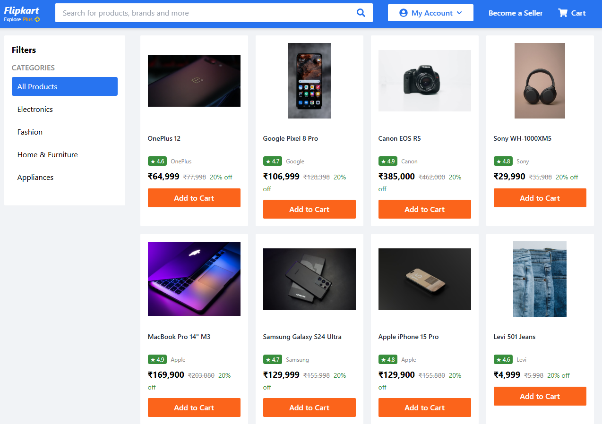
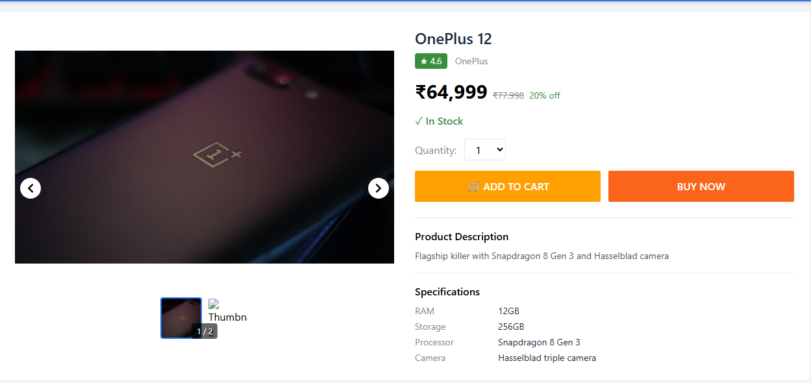
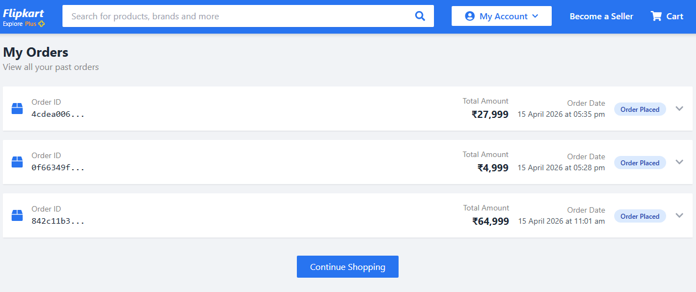

# Flipkart Clone - Fullstack E-Commerce Platform
A functional e-commerce web application that closely replicates Flipkart's design and user experience.Built as part of an SDE Intern Fullstack Assignment.

## Live Demo
| **Frontend (Vercel)** | [https://flipkkart-assessment.vercel.app/](https://flipkkart-assessment.vercel.app/) |
| **Backend API (Render)** | [https://flipkkart-assessment.onrender.com](https://flipkkart-assessment.onrender.com) |
| **Database (Neon)** | PostgreSQL Serverless |

**Note**: Replace the URLs above with your actual deployed URLs after deployment. Also if choosing render as backend the initial load time would be more - it sleeps every 15 min due to inactivity.

## Core Features Implemented

### Product Management
- Product Listing Page with Grid Layout
- Search Functionality
- Filter Products by Category (Electronics, Fashion, Home & Furniture, Appliances)
- Product Detail Page with Image Carousel
- Product Description & Specifications
- Price & Stock Availability Status

### Shopping Cart
- View All Items in Cart
- Update Product Quantity
- Remove Items from Cart
- Cart Summary with Subtotal & Total Amount

### Order Management
- Checkout Page with Shipping Address Form
- Order Summary Review Before Placing Order
- Place Order Functionality
- Order Confirmation Page with Order ID
- Order History - View All Past Orders
- Order Details - Expand to View Items & Shipping Info

### UI/UX Features
- Flipkart-like Blue Navigation Bar
- Responsive Design (Mobile, Tablet, Desktop)
- Toast Notifications for User Actions
- Loading States for API Calls
- Product Card Hover Effects
- My Account Dropdown with Order History Link
- Order History Page with Expandable Details
  
## Tech Stack
Technology
|------------|
| **React.js 18** |
| **Tailwind CSS (Play CDN)** |
| **Vite** |
| **Node.js 18** |
| **Express.js** |
| **Sequelize ORM** |
| **PostgreSQL** |

## Screenshots


!

## System Flow
### Data Flow Explanation

| Layer | Technology | Responsibility |
|-------|-----------|----------------|
| **Client** | React.js | Renders UI, manages state, handles user interactions |
| **API Layer** | Express.js | Receives HTTP requests, validates input, routes to handlers |
| **Business Logic** | SQL Queries | Processes data, applies business rules, executes queries |
| **Database** | PostgreSQL | Stores data, enforces constraints, maintains relationships |


### Key Entities

| Entity | Description | Key Fields |
|--------|-------------|------------|
| **Users** | Single default user (guest) | id, name, email, created_at |
| **Categories** | Product categories (flat structure) | id, name |
| **Products** | Product information with pricing | id, name, description, price, stock, brand, rating |
| **Product Images** | Multiple images per product | id, product_id, image_url |
| **Product Specs** | Product specifications (key-value pairs) | id, product_id, spec_key, spec_value |
| **Cart** | Shopping cart for default user | id, user_id, created_at |
| **Cart Items** | Items in cart with quantities | id, cart_id, product_id, quantity |
| **Addresses** | Shipping addresses for orders | id, user_id, full_name, phone, address_line, city, state, pincode |
| **Orders** | Order information and status | id, user_id, address_id, total_amount, status, created_at |
| **Order Items** | Items in each order (price snapshot) | id, order_id, product_id, quantity, price |

### Database Constraints

| Constraint Type | Implementation | Purpose |
|----------------|---------------|---------|
| **Primary Keys** | UUID for users, products, cart, orders; SERIAL for others | Unique identification |
| **Foreign Keys** | REFERENCES constraint with CASCADE DELETE | Maintain referential integrity |
| **Unique Constraint** | UNIQUE(cart_id, product_id) | Prevent duplicate cart items |
| **Check Constraint** | CHECK (quantity > 0) | Ensure valid quantities |
| **Default Values** | created_at = CURRENT_TIMESTAMP | Automatic timestamping |

### Indexes for Performance

```sql
-- Product Listing & Search Optimization
CREATE INDEX idx_products_category ON products(category_id);
CREATE INDEX idx_products_name ON products(name);
```
### System Workflow
1. User visits homepage
2. Browses products (grid view with categories)
3. Searches for specific products
4. Filters by category (Electronics/Fashion/Home/Appliances)
5. Views product details (images, specs, price)
6. Adds products to cart (with quantity selection)
7. Reviews cart (update quantities, remove items)
8. Proceeds to checkout
9. Fills shipping address
10. Reviews order summary
11. Places order
12. Receives order confirmation with ID

### Business Logic
Product Display Rules
- Products displayed in 4-column grid (desktop) / 2-column (tablet) / 1-column (mobile)
- Each product card shows: image, name, price, rating, brand
- Hover effects on product cards (elevation/shadow)
- "Out of Stock" badge for unavailable products

Search & Filter Rules
- Search by product name (case-insensitive, partial matching)
- Filter by category (Electronics, Fashion, Home & Furniture, Appliances)
- Search and filter can be combined
- "No products found" message for empty results

Cart Rules
- Maximum 10 items per product
- Stock validation before adding to cart
- Real-time subtotal calculation
- Free delivery on all orders (no minimum)
- 20% discount shown on all products

Order Rules
- All address fields required
- Phone number validation (10 digits)
- Pincode validation (6 digits)
- Stock deducted immediately after order
- Cart cleared after successful order
- Order ID generated and displayed

## API Documentation
- Local Development: http://localhost:5000/api
- Production: https://flipkart-clone-api.onrender.com/api

| Method | Endpoint | Description |
|----------------|---------------|---------|
| **GET** | /categories | Retrieve all product categories |
| **GET** | /products | Get all products (with search/filter) |
| **GET** | /products/:id | Get single product details |
| **GET** | /cart | Retrieve user's shopping cart |
| **POST** | /cart/add | Add product to cart |
| **PUT** | /cart/update/:itemId | Update cart item quantity |
| **DELETE** | /cart/remove/:itemId | Remove item from cart |
| **POST** | /orders/create | Create new order |

## Query Parameters

| Endpoint | Parameter | Type | Description |
|----------------|---------------|---------|-----------------|
| GET /products | search | string | Search by product name |
| GET /products | category | integer | Filter by category ID |

### Setup
Clone the Repository
```bash
git clone https://github.com/Sparsematrix09/flipkkart-assessment.git
cd flipkkart-assessment
```
Setup Database
```
Use PgAdmin for easy setup
Create db and copy paste the database.sql file using query tool
```
Backend Setup
```bash
cd backend
npm install

in .env file
PORT=5000
DB_NAME=flipkart_db
DB_USER=postgres
DB_PASSWORD=your_password
DB_HOST=localhost

then start backend
npm run dev :Runs on http://localhost:5000 
```
Frontend Setup
```
cd frontend
npm install

in .env.local
VITE_API_URL=http://localhost:5000

npm run dev: http://localhost:5173
```
Assumptions Made
- No Authentication Required
- A default guest user is assumed to be logged in User ID: 11111111-1111-1111-1111-111111111111
- Categories have no parent-child hierarchy
- Database pre-seeded with 17+ products
- Sample images from Unsplash
- No Payment Integration

